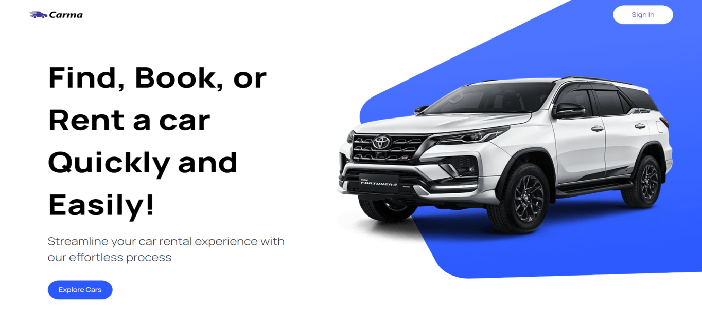

  

## Index

1. [Description](#description)
3. [Usage](#usage)
4. [Technology](#technology)
4. [Preview](#preview)
4. [Installation](#installation)
6. [Contributing](#contributing)
7. [Resources](#resources)
8. [License](#license)

## Description

This is a mock car rental app to display and develop skills using Nextjs, Typescript and TailwindCSS. 

## Usage

To use the site enter a make (with autocomplete) and model of a vehicle. The page will render all availatable types of this vehicle, gas milage and rental price. User can find out further details about each car including additional photos by clicking the view more button that displays when a particular car is hovered over with the mouse. Cars can also be sorted by model year and fuel type. (daily rental cost is an estimate based on algorythym. taking in factors of year, car type and purchase price) 

## Technology

1. `Nextjs:` React Library
2. `Git/Github:` Repo and version management.
3. `TailwindCSS`: For majority of the CSS styling.
4. `OpenAI, DALL-E`: API used to render the image
5. `Vercel`: Deployment.
6. NPM Packages: `Headless-UI`, `Mongoose`
7. `TypeScript:` Strong Variable types 

## Preview

  
 

## Installation

Setup: 
- (1) Fork the repo, (2) Clone the forked repo locally, (3) Run "npm install" (to install the dependencies), (5) Launch Server = "npm run dev". 

## Contributing

Contributor Covenant Code of Conduct

## Resources

1. GitHub Repo: <https://github.com/Hoffalypse/carma-car-nextjs>
2. Vercel Deploy: <https://carma-car-rental.vercel.app/> 

## License

This project is licensed under the terms of the The MIT License. Please click on the license badge for more information.